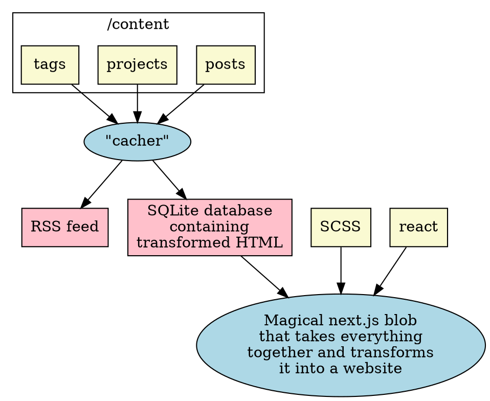

This post is the obligatory "look look I changed the website" post. I will go in
depth about the technicals of the website redesign – why I did it, how I did it,
and what my next steps are going to be.

## Why astrid.tech?

astrid.tech, from the very beginning, was a project in resume-driven
development. Sure, I wanted to show off my projects and stuff, and have a nice
record of what I have done, but frankly, that was largely in furtherance of
wanting to look like I was smart to any recruiters that passed by my site.

However, the website itself was also meant to be a way for me to learn how to do
frontend development so that I can show off how I'm hip and in tune with the
hottest frameworks, like React, Gatsby, and Next.js, and to communicate "look
look look at me I have awesome and radical web design skills, making me a great
well-rounded full-stack engineer who can do frontend _and_ backend ~~please hire
me please hire me please hire me please hire me-~~"

Thankfully I'm past that stage, and I now have my comfy tech job.[^1] So, I
decided that it was high time for a new stage of astrid.tech, one that didn't
need to be as serious or resume-paddy, but most importantly, one that wasn't 4
versions of Next.js behind or however many it is now.

[^1]: until the next round of layoffs happens...

## astrid.tech v1 and v2

How do you create a post in v1 or v2? You add it to the content folder of the
astrid.tech directory in a very specific way, with graymatter looking like
this:[^v2author]

```yaml
---
title: Top 4 shitty Github Actions hacks that I used this weekend
description: "#2 will make you vomit because I sure did"
date: 2022-04-04 17:37:04-07:00
ordinal: 0
tags:
  - /projects/infrastructure
  - github
  - nixos
  - ci-cd
  - incompetency
---
```

[^v2author]:
    Okay, so technically, it needs to go in a very specific directory format,
    one of `/year/month/day/ordinal/slug-name/index.md`,
    `/year/month/day/ordinal/slug-name.md`,
    or`/year/month/day/ordinal/index.md`, where the first and second are
    equivalent, and the third specifies an untitled post for
    microblogging.[^microblogging] The `slug-name` part is important, and so is
    the `ordinal` part. What does the `/year/month/day` part affect? Absolutely
    nothing, because the slug gets calculated based on the publish date. I don't
    know why I made it this complicated, but v3 got rid of this complication.

[^microblogging]:
    As for the microblogging part, I added microblogging after talking to some
    IndieWeb people and thinking that might be neat. However, I found that it
    was inconvenient to do microblogging on my website; it was more convenient
    to just use Twitter, and then the Fediverse. The blog was better off for
    long-form content, so v3 gets rid of that.

Simple right? Now how do you preview the post before embarrasing yourself?

You run these commands:

```
$ ts-node cacher/index.ts
$ next dev
```

Or something along those lines. I don’t remember, I haven’t blogged in over a
year. Here’s the diagram of how the data flows in this system:



The "cacher" does the actual markdown transformation so that the Next.js code
can simply read it into memory and render.

Now, this worked relatively well... except that this whole process took probably
a whole minute just to see a preview. But that's okay, I can read markdown
manually and don't need a preview!

### Actually deploying the site

I push to Github and [Vercel](https://vercel.com) takes care of the rest.
Ironically, this part is the most straightforward part of the pipeline.

### Where it fell apart

You see that magical next.js blob that takes everything together and transforms
it into a website? What happens if that breaks? Well, you don't have to wonder,
because it did.

Next.js 12 was released. It provided faster compilation speeds due to the Rust
transpiler it included. Unfortunately for me, I had already customized the fuck
out of the Babel transformer that Next.js 11 used. And for some reason, even
configuring Next.js 12 to use Babel still caused an insane number of errors
everywhere in my React code and other stuff. After a week or two of attempting
to massage the codebase into being happy with v12, I gave up. I couldn't for the
life of me get it to even _compile_, not to mention _serve_.

I decided to abandon the old version, keep it on maintenance mode, and not do
upgrades.

## Trying to rewrite the CMS in... something

So I could have used Wordpress or some other pre-made CMS at this point, but
that's no fun! It needs to be made by me. It needs to be Astridware. And
Astridware means it needs to be overcomplicated.

I probably made 10 or so attempts at doing this, with all sorts of complicated
architectures. These were made in Python, Typescript, Haskell, and Rust,
although the attempts I spent the most time on were in Haskell and Rust.

```dot: Remember that this is me trying to make a personal fucking website!
digraph G {
    rankdir=LR;
    node [shape=box]

    subgraph cluster_author {
        label = "author's local machine";

        uploader;
        contentdir [label="content directory", style=filled, fillcolor=lightgoldenrodyellow]
    }

    subgraph cluster_server {
        label = "server";

        webapp;
        db [label="postgres"];
    }

    user [shape="plaintext"]
    uploader, webapp, db [shape="oval"]

    uploader, webapp, db [style=filled, fillcolor=lightblue]

    contentdir -> uploader;
    uploader -> webapp [label="HTTP???", style=dashed];
    uploader -> db [label="???", style=dashed];
    user -> webapp [label="HTTP"];
    webapp -> db;
}
```

Interestingly, I actually ended up really delving deep into Haskell, and
learning a lot about how you write real server code in Haskell, despite the fact
that I didn't end up building it in Haskell at the end.

These are the major issues I ended up encountering during this phase:

- **Indecisiveness:** I was truly indecisive on what kind of architecture I
  wanted, what language I wanted to implement it in, how complicated I wanted it
  to be, and so on. Some attempts were very simple; that diagram above is merely
  one of many attempts.
- **Overengineering:** I wanted to make it really complicated and support all
  sorts of features and support this spec and that spec and this standard and
  that standard and have this feature and that feature and this architecture and
  that architecture and
- **Lack of motivation:** I had better projects to work on than this shit, like
  Caligula or my infrastructure.

And I ended up in this deadlock state too, where if I wanted to write a new blog
post, I wanted to rewrite my CMS, but rewriting the CMS means I'm taking time
away from writing blog posts.

### Breaking the deadlock

In late January 2024, I felt bad for not having blogged for over a year. Reading
other people's blogs made me want to get back into the game.

The old astrid.tech was so deeply unmaintained that I don't even know if the
Vercel pipelines ran anymore. That was when I decided that I was going to pump
out the CMS, and pump it out fast.

I broke the indecisiveness and overengineering problem by making the site a
simple static site that I had the option to turn dynamic later if I wanted. I
stuck with Rust, and also I stuck to a fairly small featureset that I tried not
to overengineer too much:

- it must be able to read markdown files
  - it can transform LaTeX math into HTML math
  - it can transform GraphViz code into an SVG
- it must display projects, blog, and tags
- it must have a SCSS -> CSS pipeline
- it must have a Typescript -> JS pipeline
- it must have a non-trivial homepage

All these requirements are interpreted as minimally as possible. I don't need to
put that many fancy flourishes on the site, it just needs to be deployable, and
something I can improve with time. Also, I didn't even try to make it that
performant, either.

Then, I broke the lack of motivation problem by writing a couple of draft blog
posts that I really wanted to see the light of day. With a bunch of hard effort,
I got it pushed out within the last month.

## The Seams CMS

If you're wondering why I called it Seams, try saying CMS in one syllable.

The pipeline for authoring a post is similar to before, but much more
straightforward and less Quirky. No more weird directory-dependent slug bullshit
like before.

```yaml
---
title: Top 4 shitty Github Actions hacks that I used this weekend
tagline: "#2 will make you vomit because I sure did"
tags:
  - project:infrastructure
  - github
  - nixos
  - ci-cd
  - incompetency
slug:
  date: 2022-04-05
  ordinal: 0
  name: infra-repo-gh-actions
date:
  created: 2022-04-04 17:37:04-07:00
  published: 2022-04-04 17:37:04-07:00
---
```

I also moved the content out into a separate repo from the program is now a
separate repo from the content, which should make commit logs and repo sizes
less of a pain to deal with, especially when the content includes media assets.

To get a preview of the site, I run `nix build` from the content repo and I get
a website. And I hate to say the funny words, but it is indeed, well, _blazingly
fast_.

```
$ time nix build
warning: Git tree '/home/astrid/Documents/astrid.tech-content' is dirty
nix build  1.36s user 0.51s system 33% cpu 5.512 total
```

From there, I need to view it in a browser, and I just run the Python HTTP
server for that:

```
$ python3 -m http.server -d result/
```

### Beware the pipeline

```dot: The new pipeline. It looks more complicated, but unlike before, I actually understand how each step builds.
digraph "v3" {
    shape=box;

    subgraph "cluster_content" {
        label="/content"
        rankdir=LR;
        posts, projects, tags;
    }

    subgraph "cluster_seams" {
        label="Embedded in Seams"
        seams [label="Seams"]
        maud [label="Maud\ntemplates"]
        maud -> seams
    }

    scss [label="SCSS"]
    scssnix [label="Nix derivation\n that runs sass"]
    typescript [label="Typescript"]
    staticsite [label="Static site"]
    sitenix [label="Site nix\nderivation"]
    html [label="Site HTML"]
    js [label="Site JS"]
    css [label="Site CSS"]
    rss [label="RSS feed"]

    posts, projects, tags, scss, typescript [fillcolor=lightgoldenrodyellow, style=filled];
    seams, scssnix, sitenix, rollup, maud [shape=oval, fillcolor=lightblue, style=filled]

    {posts, projects, tags} -> seams -> html;
    typescript -> rollup -> js;
    scss -> scssnix -> css;

    {html, js, css} -> sitenix -> {staticsite, rss};
}
```

"Keep it simple" sometimes doesn't mean "reduce the build steps." Technically,
v3 has more "steps" than v2, but v3 doesn't have a big-magical-blob-step that
can change under my nose and break my strangely-tuned setup.

### The bloat situation

These sizes are all compressed values, in megabytes. This is how drastically
smaller my website has become.

| Version | HTML + CSS + JS | All assets |
| ------: | --------------: | ---------: |
|      v2 |           0.363 |      15.21 |
|      v3 |           0.012 |       0.58 |

I no longer use React on this website because it's admittedly super duper
bloated, big, and frankly overkill. Again, when I chose the tech stack, I was
looking to pad my resume, even if it meant padding my asset bundle.

For those little widget things, they're either Rust functions at the HTML
rendering step, or implemented in vanilla Typescript using
[custom elements](https://developer.mozilla.org/en-US/docs/Web/API/Web_components/Using_custom_elements).

Funnily enough, although v3 is <m>\frac{1}{30}</m> of the size of v2, it
probably makes up 70% of the feature set of v2.

## Next steps

For the time being, I will likely focus on making blog posts rather than adding
features to my site. I'm quite behind on blogging, after all. But if I were to
spend more time on my site, I'd implement some features v2 had:

- javascript widget to filter projects by tags
- linking `project:` tags to their actual projects
- webrings
- humans.txt
- now page
- `$` delimited LaTeX (right now instead of saying `$\frac{1}{2}$` you say
  `<m>\frac{1}{2}</m>`. Yes I invented a new html tag for this I'm sorry whatwg)
- importing tag colors from github's linguist
- open source licenses page (probably not needed tho)
- analytics (I want to see the funny page visits number go up I'm sorry for
  stealing your data)
- live reloading the website for authoring (although this isn't too critical if
  builds are only 5 seconds)
- tag similarity calculation

I'd like some of these features as well, which v2 did not have:

- ipynb transformation
- interactive programmable charts embedded inside markdown
- food recipes
- actual dynamic site stuff
- year and month summaries
- a word cloud of tags

Seams is very very astrid-specific software and is not yet customizable for
other people. In the far future, perhaps I will make it more adaptable to
others' needs, like Jekyll or Wordpress.
