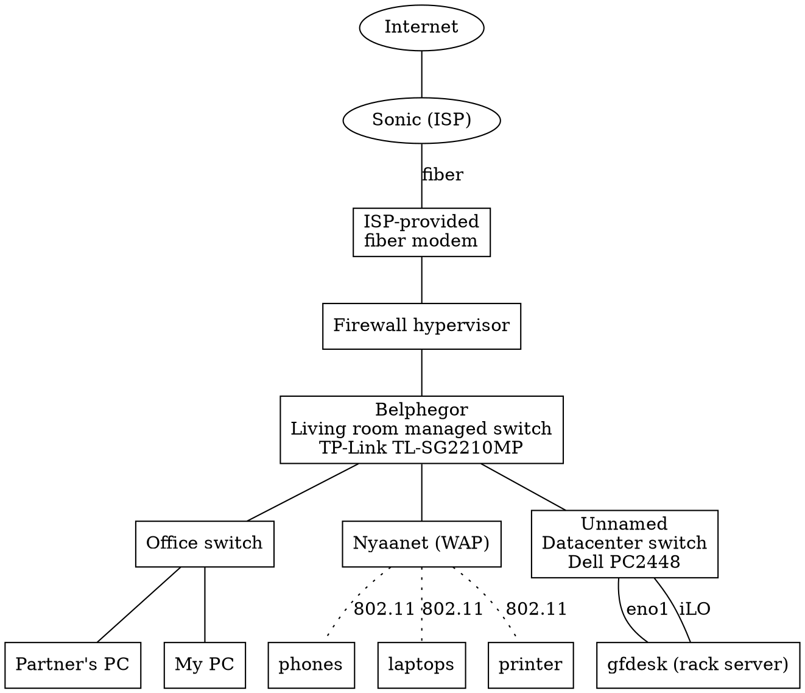

In the past week, I have made many changes to my homelab. Here's a summary of
what I did, and the many, many, many issues I had to contend with due to a mix
of incompetence and cheapness.

## State of the homelab, end of 2023

When I moved into the new apartment, I had grand plans for VLAN-segmenting every
part of my homelab and ensuring maximal security. I was going to put all the
management stuff on one VLAN (69, with corresponding subnet 192.168.69.0/24
because I'm a very creative and funny person), all the infra stuff on its own
subnet, all the user stuff on its own subnet, and firewall the crap out of it.

This is how my network looked before the big changes I made.

Well, that didn't work out so well, largely because of the stuff I had
available.

The Datacenter switch was a Dell PowerConnect 2824 that I purchased 3 years ago
for maybe $30, when I was just getting into homelabbing. When I tried setting it
up here, I was like "hey, I would like to configure it using a CLI."
Unfortunately, this is one designed for people intimidated by CLIs, so it has a
very clunky slow web interface. Plus, I didn't have rack ears for it, so it had
to jankily sit on top of my servers.

Instead of using that, I thought "hey, let's use its probably-better datacenter
cousin that has a CLI, the 5448!" This thing was also $30 or so.

Well, when I got it, the console seemed to be broken, I couldn't get any output
from it. So that was a bust. Plus, it didn't have 10G anyway.

As a result, I just kept everything downstairs on the 2824, all on one subnet,
because I felt like doing other things besides unfucking used switches.

Note that everything on here is on one subnet, 192.168.1.0/24, and the wifi is
on subnet 192.168.2.0/24. I had intended to put iLO and other things on their
own subnet (192.168.69.0/24), but the ethernet switch I got, a Dell PowerConnect
5448, seemed to be bricked.

This all happened months ago. At some point, I bought a new server and was about
to configure it to run... something, but didn't have the time.

But then, two weeks ago, I decided that enough was enough! I needed a new
switch, I needed proper VLAN segmentation, I needed proper firewalling,
networking, access control, proper new server setup, disk encryption, and all
the other goodies that I don't have!

It was time for an overhaul!

## Trying to set up the new switch, and failing badly (3/19)

The switch I got was a used Brocade ICX6450-48P, which has sorts of neat
features like layer 3 protocols, 10G SFP+, and more for a mere $80.

When I got it, I tried configuring it. Initializing it requires a
serial-over-RJ45 connector, so I plugged mine in and tried connecting. Well,
after two hours of attempting over and over again through minicom, with every
possible combination of baud, I still couldn't get any communication out of the
switch.

Well, I looked at the serial port specifications one more time. It turns out
this was the reason.

Don't see it? Look at what pins are wired and not.

My USB serial RJ45 was for programming Anytone mobile radios. Well, I couldn't
do much here but buy a new serial adapter that was specifically for these kinds
of things.

After I put an order on that, I couldn't help but think back to how my
PowerConnect 5448 wasn't returning any data either, and I couldn't help but
wonder if that also had to do with pin wiring. So, I thought that I might as
well also buy a null modem adapter while I was at it, to crossover the RX and TX
pins. They're very useful for a lot of things in general, anyways.

[I went and wrote a shitpost about C++ while I waited for them to arrive.](https://astrid.tech/2024/03/19/0/maybe-monad-cpp/)

## Setting up the switch for real this time! (3/21)

Both things arrived together. Just out of curiosity, though, I tried to see if
the null modem was why the PowerConnect 5448 wasn't working. I connected the
switch to a mini gender changer to a null modem to a DB9 serial USB adapter to
my desktop, and sure enough, it worked.

I guess I technically didn't need the new switch, I could have just used the old
one if I had thought about using a null modem. Oh well, this one doesn't have
10G, screw it.

However, when I connected the RJ45 serial adapter to my laptop, and connected it
to the ICX-6450...

Yeah, that's pretty bad. Why did it do that? I tried a ton of things:

- Was the clock slightly off on that thing? Unfortunately, Linux didn't let me
  set the device to 9500 baud.
- 4800 baud was absolutely not.
- Parity bits and such were also a dead end.

Perhaps it was minicom? I used `cat` to read and write, and interestingly
enough, write always seemed to work. Either way, I seemed to be able to reset it
from its original configuration where it was in some datacenter in
god-knows-where.

I was so perplexed, when all of a sudden, I switched to another workspace on my
laptop's window manager, and found... valid output‽

I wondered why it suddenly worked, when it dawned on me that this terminal had
been open in the background this entire time.

The switch's output was valid and working the entire time.

When two minicoms are open on the same port, they eat each others' bytes.

Each minicom only sees approximately every other byte.

That's why the text was skipping so much.

They race condition each other.

I could reproduce it by simply starting a second minicom.

Well, after realizing my mistake, I was able to set it up to connect remotely
via telnet, but only on VLAN 69, the management VLAN. So yeah, I now have a
working managed switch that I can configure from the comfort of my own
dual-monitor computer.

I did set more stuff up too, also running into different issues; I will cover
those in later blog posts.

## Conclusion

minicom likes to eat other minicoms' bytes because it's an awful piece of
software that apparently didn't implement device locking
