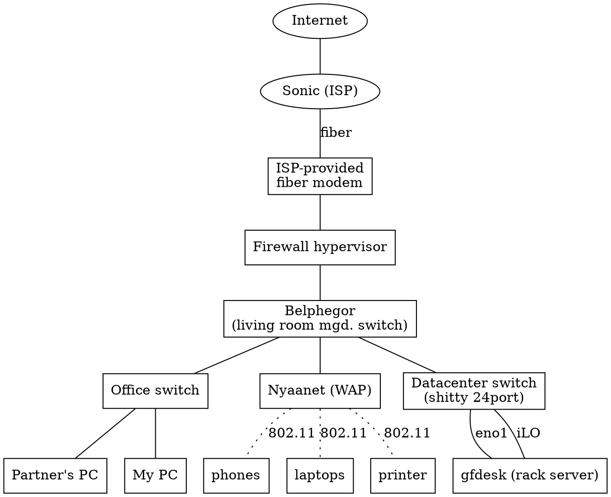

## State before

This is how my network looked before the big changes I made.

## Issues I ran into

### Firewall can't route between VLAN 10 and VLAN 69?

https://s3.us-west-000.backblazeb2.com/nyaabucket/0a7e04250877b4bcef9e542d176afc02b2dae7f55ba66b53cc844dd8db799d9e.png
